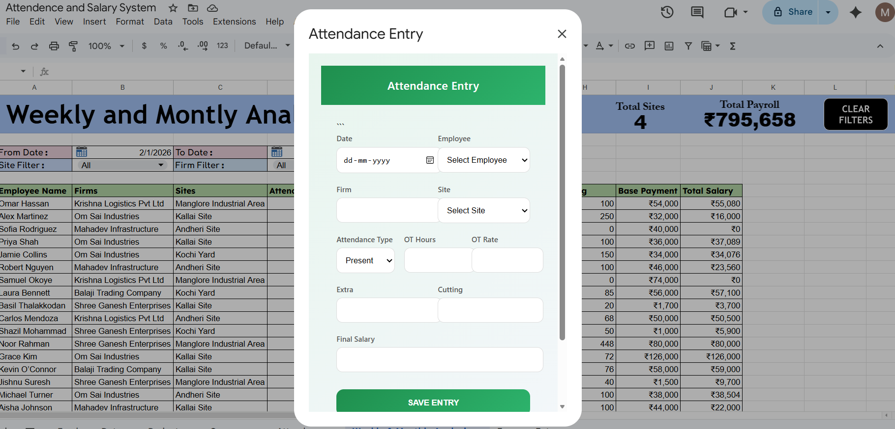
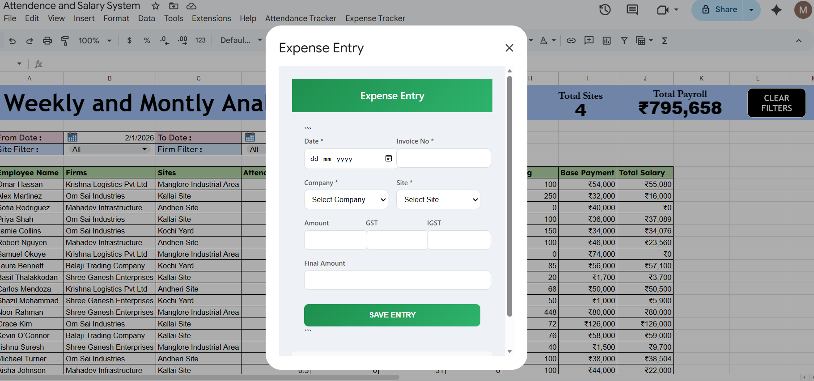
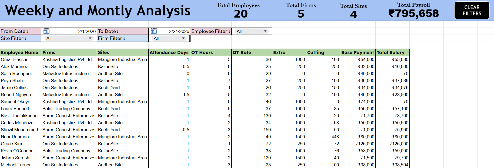
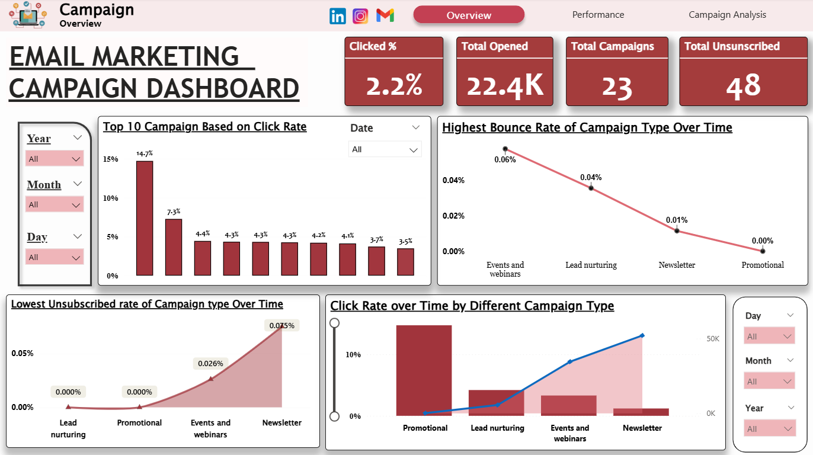
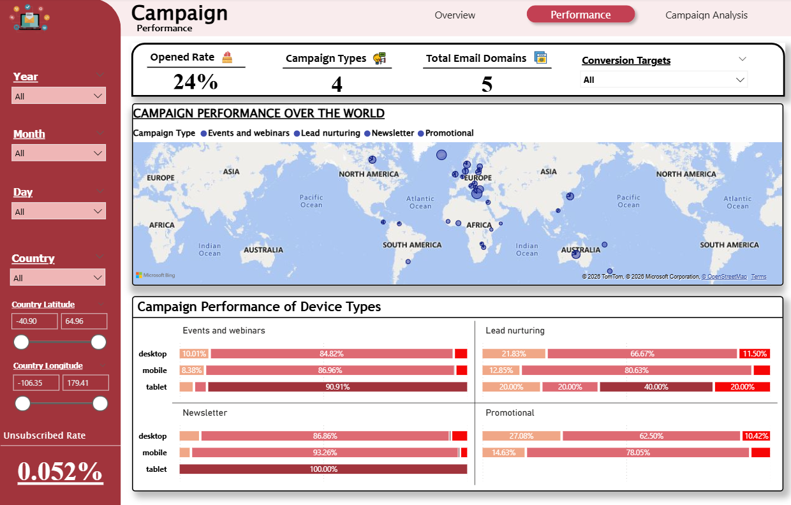
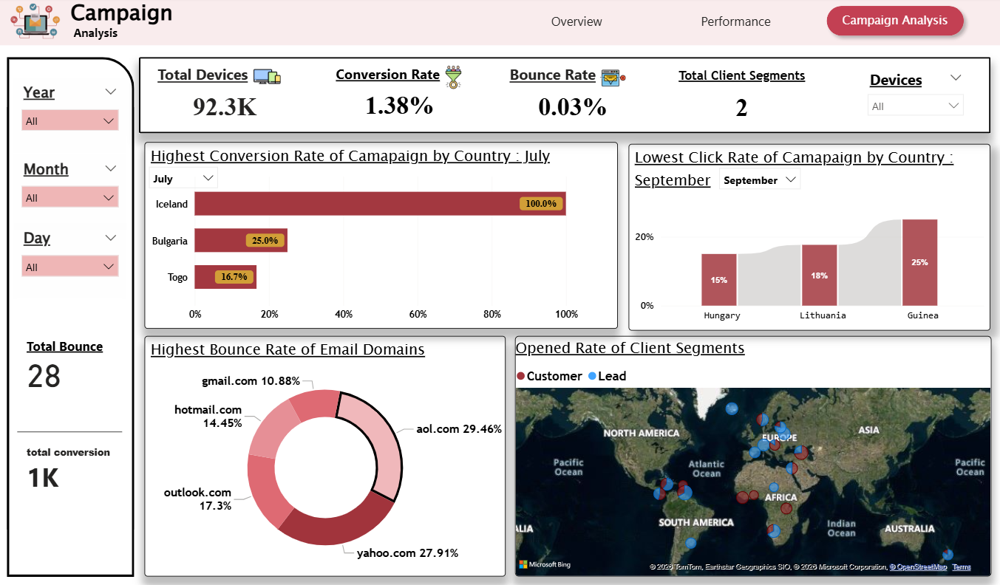
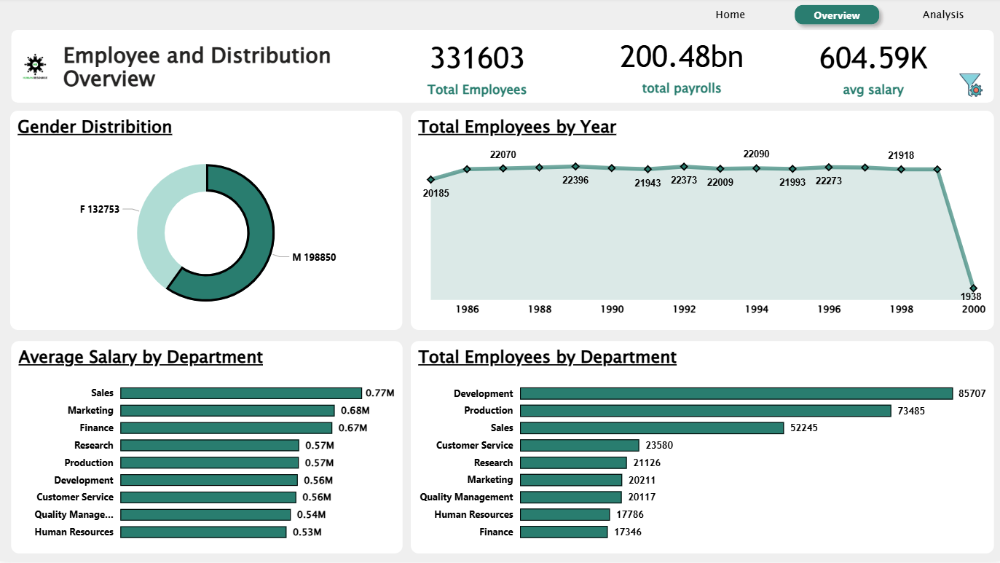
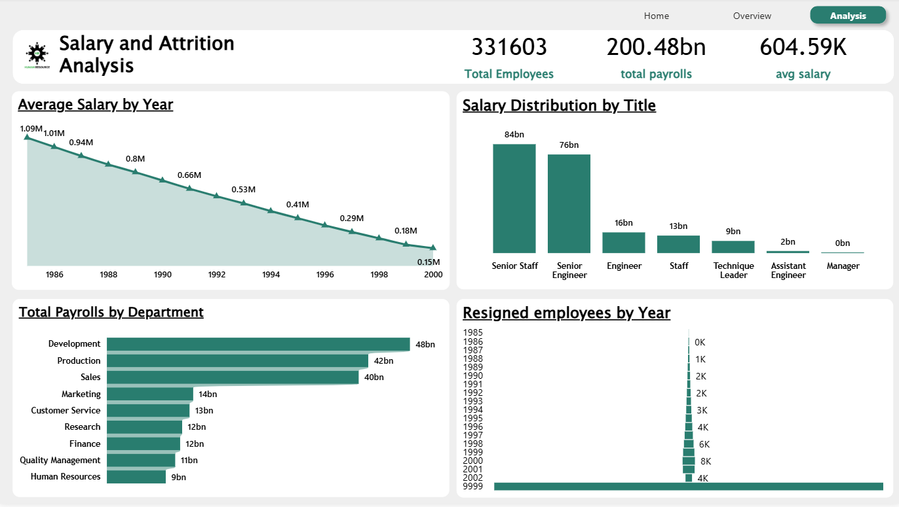

# Hi, I'am Mohammad Sahil
### Data Analyst | Data-Driven  Decision Making |
### Transforming Insights into impact
---

## 🌟 About Me  
detail-oriented Data Analyst with hands-on experience in **Excel**, **Power BI**, **SQL**, and **Tableau**,I specialize in transforming raw data into meaningful insights through data cleaning, visualization, and dashboard creation.As a fresher, I bring strong problem-solving abilities, logical thinking, and a continuous learning mindset. 

---

## 💼 Work Experience  

### 🔹  Data Analyst Intern — Rows & Columns · Calicut, Kerala

- Performed end-to-end data preparation using Excel, SQL, Power BI and Tableau.
- Streamlined reporting workflows with automation and reusable templates.
- Delivered insight-driven dashboard presentations.

---

## 🧩 Projects  

### 🔹 Automated Fuel Cost optimization System  – (Advanced Excel + VBA)

- Developed an Excel VBA Fuel Pricing System with automated currency and unit conversions.
- Designed a professional data entry UserForm with real-time pricing calculations.
- Built a structured database with auto-serial numbering and reporting functionality.

###  📸 Dashboard Preview

---

### 🔹 Workforce & Payroll Analytics Automation System - (Google Sheets + Google App Script)

- Designed and deployed an automated workforce analytics system transforming raw attendance and expense data into structured, decision-ready dashboards.
- Engineered dynamic reporting models with real-time filtering and KPI tracking to analyze employee utilization, payroll costs, and site-level performance.
- Implemented end-to-end automation using Google Sheets and Apps Script to streamline attendance tracking, payroll computation, and expense management workflows.

###  📸 Dashboard Preview

  

---

### 🔹 Email Marketing Campaign Dashboard - (Excel + PowerBI)

- Built an interactive Email Marketing Dashboard to track and analyze key KPIs such as CTR, Open Rate, Bounce Rate, and Unsubscribe Rate.
- Performed trend and comparative analysis to identify top-performing and underperforming campaign types.
- Transformed raw marketing data into actionable insights to support data-driven decision-making.

###  📸 Dashboard Preview
  
  
  
  
  

---

### 🔹 HR Analytics Dashboard - (MySQL + PowerBI)

 - Analysed organisation-wide employee data.
 - Identified diversity gaps and attrition patterns.
 - Created a consolidated HR dashboard for insights.

###  📸 Dashboard Preview
   
   
   

---

## 🎓 Education  
- **Pre-University Course (PUC) – Commerce**  
  *KSEAB, Uttara Kannada*

---

  
## 🧠 Tools & Skills  
 
 
 

---

## 🎯 Interests
  Activities That i Enjoy:
  
- 📊 **Dashboard Design**  
- 📈 **Data Analysis**  
- 🎤 **Singing & 🎒 Traveling**

---

## 📫 Contact Details  
*Let’s Connect and Build Smarter Solutions!*  

<table>
  <tbody>
    <tr>
      <td>📧</td>
      <td><a href="mailto:sabsahil049@gmail.com">sabsahil049@gmail.com</a></td>
    </tr>
    <tr>
      <td>📞</td>
      <td>(+91) 7829221859</td>
    </tr>
    <tr>
      <td>📍</td>
      <td>Uttara Kannada, Karnataka</td>
    </tr>
    <tr>
      <td>⬇️</td>
      <td><a href="sahil's resume 2026.pdf">Download my CV</a></td>
    </tr>
    <tr>
      <td>🌐</td>
      <td><a href="https://www.linkedin.com/in/mhdsahilsab">Let’s connect on LinkedIn</a></td>
    </tr>
  </tbody>
</table>

  

  

  
